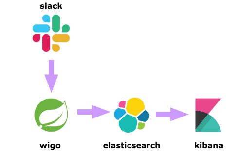

# WIGO - What Is Going On

WIGO is a simple Java Spring App that grabs messages from Slack and sends them
to Elasticsearch for posterior analysis using Kibana.



## How to run it

1. clone the repository
1. start Elasticsearch and Kibana 
```bash 
$ docker-compose up -d
```
1. run the application providing the necessary information
```bash
$ SLACK_TOKEN=xoxb-XXXXX \
SLACK_CHANNEL=XXXXX \ # this is the code of the channel, not the descriptive name
SLACK_MESSAGES_FROM_DAYS=10 \
mvn spring-boot:run
```

### TODO:

* Generalize filters
* Include the conversation in Slack threads
* Figure out how to get good insights from the data using Kibana
